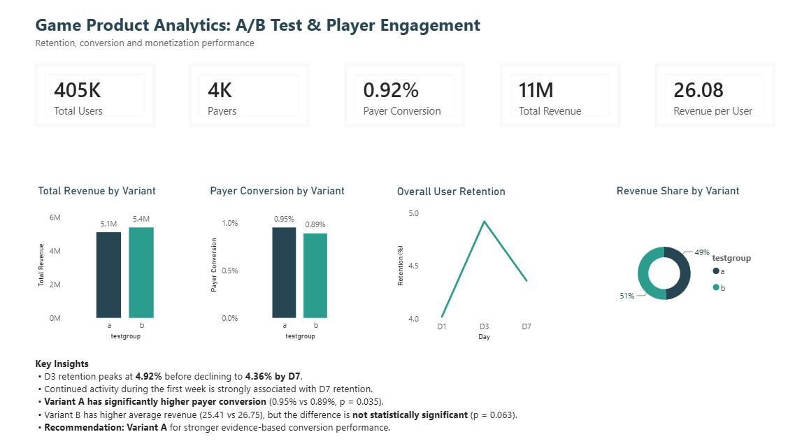

# Game Product Analytics: A/B Test & Player Engagement

Product analytics project analyzing player retention, early engagement, conversion, and monetization to evaluate an A/B test and identify actionable product insights.

## Dashboard



## Objective

The objective of this analysis is to understand player behavior during the first week, measure retention and monetization, and determine whether the A/B test produced a meaningful improvement in key product metrics.

The analysis focuses on:

- Player retention (D1, D3, D7)
- Early engagement and its relationship with D7 retention
- Payer conversion across A/B test groups
- Revenue and revenue per user
- Statistical significance of A/B test results
- Business recommendation based on the experiment

## Dataset

The project uses three datasets:

| Dataset | Records | Purpose |
|---|---:|---|
| Registration | 1,000,000 | User registration information |
| Activity | 9,601,013 | Player login/activity data |
| A/B Test | 404,770 | Experiment group, revenue and activity metrics |

The A/B test contains two experiment groups:

- **Group A:** 202,103 users
- **Group B:** 202,667 users

## Tools & Technologies

- Python
- Pandas
- NumPy
- SciPy
- Statsmodels
- Jupyter Notebook
- Power BI

## Analysis

### 1. Data Quality

The datasets were checked for:

- Missing values
- Duplicate user records
- Data types
- Date conversion and consistency

No missing values or duplicate user records were found in the analyzed datasets.

### 2. Player Retention

Overall retention was calculated for Day 1, Day 3, and Day 7.

| Metric | Retention |
|---|---:|
| D1 | 4.02% |
| D3 | 4.92% |
| D7 | 4.36% |

Retention increased from D1 to D3, peaked at D3, and declined slightly by D7.

### 3. Early Engagement

Early activity during the first week was compared with D7 retention.

Users who remained active later in the first week showed substantially higher D7 retention, indicating that continued early engagement is an important retention signal.

| Day of early activity | D7 retention |
|---|---:|
| D3 | 36.89% |
| D4 | 52.63% |
| D5 | 70.10% |
| D6 | 79.07% |

This suggests that encouraging repeated engagement during the first week could be an important product retention opportunity.

### 4. A/B Test: Payer Conversion

Payer conversion was compared between the two experiment groups.

| Group | Payer Conversion |
|---|---:|
| A | 0.95% |
| B | 0.89% |

A two-proportion z-test was used to evaluate whether the difference was statistically significant.

**p-value = 0.035**

Since the p-value is below 0.05, the difference in payer conversion is statistically significant.

**Result:** Group A has significantly higher payer conversion than Group B.

### 5. A/B Test: Revenue

Average revenue was compared between the two groups.

| Group | Average Revenue |
|---|---:|
| A | 25.41 |
| B | 26.75 |

A statistical test was performed to determine whether the difference in revenue was significant.

**p-value = 0.063**

Since the p-value is above 0.05, there is insufficient evidence to conclude that the observed revenue difference is statistically significant.

Although Group B has higher average revenue, the result is not statistically significant.

## Key Findings

- D3 retention was highest at **4.92%**, before declining to **4.36% by D7**.
- Continued activity later in the first week was strongly associated with D7 retention.
- **Group A significantly outperformed Group B in payer conversion** (0.95% vs 0.89%, p = 0.035).
- Group B had higher average revenue (26.75 vs 25.41), but the difference was **not statistically significant** (p = 0.063).

## Business Recommendation

Based on the statistical evidence, **Group A is the recommended variant**.

While Group B showed higher average revenue, the difference was not statistically significant. Group A, on the other hand, demonstrated a statistically significant improvement in payer conversion.

Further experimentation could focus on understanding why Group B generates higher revenue per user while preserving the stronger conversion performance observed in Group A.

## Power BI Dashboard

The Power BI dashboard summarizes:

- Overall product KPIs
- Revenue by A/B variant
- Payer conversion by variant
- D1/D3/D7 retention
- Revenue share by variant
- Key analytical insights and recommendation

## Project Structure

```text
Game-Product-Analytics/
│
├── game_product_analytics.ipynb
├── README.md
├── dashboard/
│   └── game_product_analytics.pbix
└── screenshots/
    └── dashboard.png
